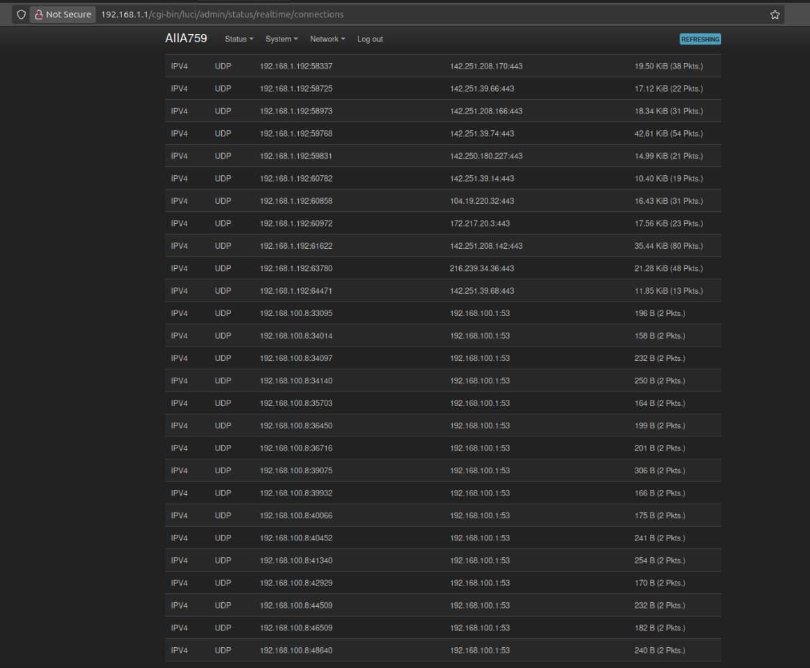
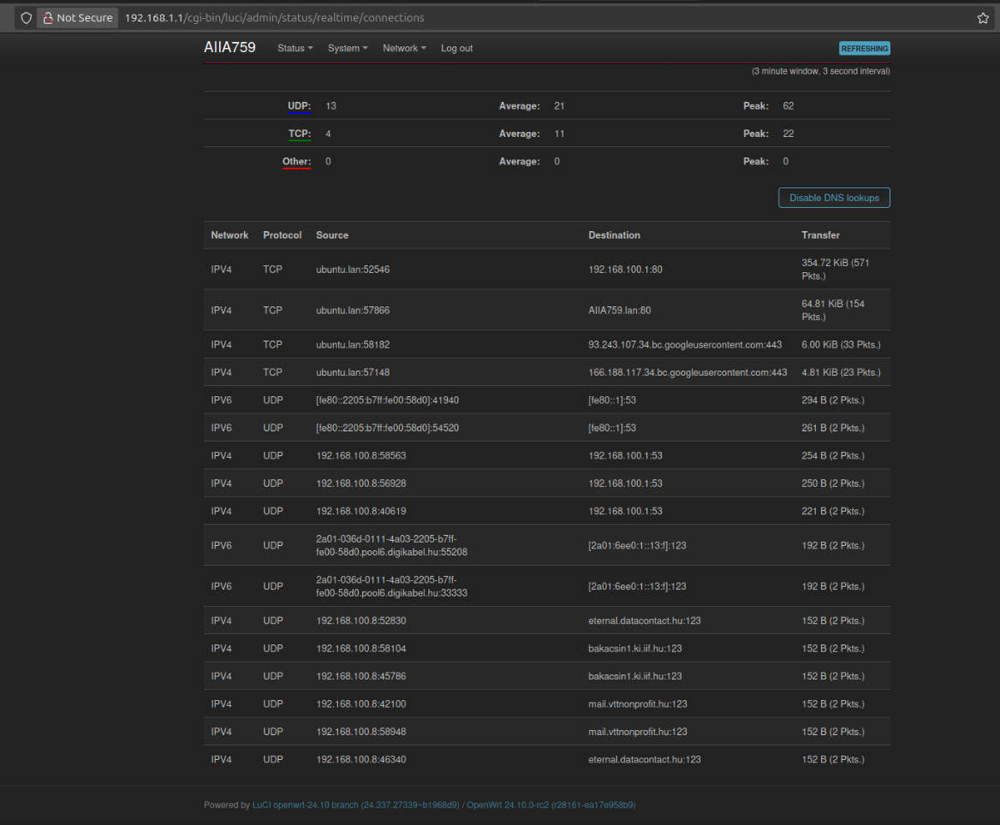

# NTP attack investigation

I think I discovered some kind of design flaw in the way Network Time Protocol is working which is currently actively expoited on my computer and it might enable third parties to read all TLS encrypted traffic that my computer is sending so I created this public repository to document these phenomena. Please feel free to fork this or contribute in any way to further this cause.

I received my diploma a few months ago at Budapest Unversity of Technology and Economics as a Computer Operational Engineer (BPROF), I was an intern at Cisco yet I am struggling to find a new job.
I think I am good at remembering specific things, and I remember that on one of the classes where we solved practical excercises the guy who teached us told at some point, that the next excercise which was about setting up NTP on a linux machine should be solved in such a way that they described it in __the email__. I also remember, that I said it out loud that "I did not receive any email about this" and of course I was unable to solve that problem.

I purchased an OpenWRT One router, which has a really good feature under Status > Realtime Graphs > Connections
It shows the currently running source ip:port to destination ip:port traffic with the transferred bytes and packets. I have some images about the UI but I can make new screenshots of course. I noticed that one of the interfaces of the brand new router sends frequent udp packets towards many NTP servers.





Then I used tcpdump on my laptop which showed lots of traffic towards even more different servers and the _transmitted timestamp is always wrong by decades_.

```sh
sudo tcpdump -i wlp3s0 udp dst port 123 -vvv
```

```console
14:27:39.633013 IP (tos 0xb8, ttl 64, id 25543, offset 0, flags [DF], proto UDP (17), length 76)
    ubuntu.lan.ntp > etharin.fidesz.hu.ntp: [udp sum ok] NTPv4, Client, length 48
	Leap indicator:  (0), Stratum 0 (unspecified), poll 0 (1s), precision 32
	Root Delay: 0.000000, Root dispersion: 0.000000, Reference-ID: (unspec)
	  Reference Timestamp:  0.000000000
	  Originator Timestamp: 0.000000000
	  Receive Timestamp:    0.000000000
	  Transmit Timestamp:   215924456.708249765 (1906-11-05T03:00:56Z)
	    Originator - Receive Timestamp:  0.000000000
	    Originator - Transmit Timestamp: 215924456.708249765 (1906-11-05T03:00:56Z)
14:27:39.791891 IP (tos 0xb8, ttl 52, id 36727, offset 0, flags [DF], proto UDP (17), length 76)
    etharin.fidesz.hu.ntp > ubuntu.lan.ntp: [udp sum ok] NTPv4, Server, length 48
	Leap indicator:  (0), Stratum 3 (secondary reference), poll 3 (8s), precision -23
	Root Delay: 0.026046, Root dispersion: 0.044662, Reference-ID: 0xc1e3c502
	  Reference Timestamp:  3952583754.000853736 (2025-04-02T11:55:54Z)
	  Originator Timestamp: 215924456.708249765 (1906-11-05T03:00:56Z)
	  Receive Timestamp:    3952585659.764912403 (2025-04-02T12:27:39Z)
	  Transmit Timestamp:   3952585659.765026022 (2025-04-02T12:27:39Z)
	    Originator - Receive Timestamp:  +3736661203.056662637
	    Originator - Transmit Timestamp: +3736661203.056776256
```

The weird dates seem more than suspicious to me although it seems that my computer is sending the bad timestamps first and it is always something completely different datetime.

A lot more of these packets can be found in the tcpdump-output folder.

Based on the available resources online I have the fear that I am one of the few who did not know about this phenomenon of NTP although it is basically common knowledge but still noone really talks about it.
As of my current understanding this problem can be mitigated on your local area network by using a custom NTP server that gets its timesource from GPS or an atomic clock.

I found the following paper about NTP attacks from Boston Unversity:

## Attacking the Network Time Protocol

Aanchal Malhotra, Isaac E. Cohen, Erik Brakke, and Sharon Goldberg
aanchal4@bu.edu, icohen93@bu.edu, ebrakke@bu.edu, goldbe@cs.bu.edu
Boston University, Boston, MA.
<https://www.cs.bu.edu/~goldbe/papers/NTPattack.pdf>

> Abstract — We explore the risk that network attackers can exploit unauthenticated Network Time Protocol (NTP) traffic to alter the time on client systems. We first discuss how an onpath attacker, that hijacks traffic to an NTP server, can quickly shift time on the server’s clients. Then, we present a extremely low-rate (single packet) denial-of-service attack that an off-path attacker, located anywhere on the network, can use to disable NTP clock synchronization on a client. Next, we show how an off-path attacker can exploit IPv4 packet fragmentation to dramatically shift time on a client. We discuss the implications on these attacks on other core Internet protocols, quantify their attack surface using Internet measurements, and suggest a few simple countermeasures that can improve the security of NTP.

I do not understand this paper completely but others might be able to prove or disprove what happens on my network is related to this.

If I understand this right and it really is an attack then I am under attacked by the servers of political parties, institutions and companies like FIDESZ, Telekom, NIIF and and a company that can be connected to a hacker group at BME and all of my network traffic could be compromised. I might not be the only one who suffers from this.

I made a list of some the resolved addresses my computer is talking to:

- rave.fidesz.hu.ntp
- bakacsin1.ki.iif.hu.ntp
- ntp1.niif.hu.ntp
- zearla.netinform.hu.ntp
- yikes.bl2.tolna.net.ntp
- www.kapos-net.hu.ntp
- webmail.edupress.hu.ntp
- wdcproxy1.backup.einfra.hu.ntp
- cebece.pomaz.hu.ntp
- mail.deployis.eu.ntp
- etharin.fidesz.hu.ntp
- BC9C7207.catv.pool.telekom.hu.ntp
- trabant.uid0.hu.ntp
- zearla.netinform.hu.ntp
- ntp2.niif.hu.ntp
- blackmage.ki.iif.hu.ntp
- quaen.fradi.hu.ntp
- mailgateway.zsurob.hu.ntp
- server3.fidesz.hu.ntp
- mail.vttnonprofit.hu.ntp
- cns0.telekom.hu.ntp
- zaonce.fidesz.hu.ntp

```console
ghj@ubuntu ~> ntpq -p
     remote                                   refid      st t when poll reach   delay   offset   jitter
=======================================================================================================
 0.ubuntu.pool.ntp.org                   .POOL.          16 p    -  256    0   0.0000   0.0000   0.0001
 1.ubuntu.pool.ntp.org                   .POOL.          16 p    -  256    0   0.0000   0.0000   0.0001
 2.ubuntu.pool.ntp.org                   .POOL.          16 p    -  256    0   0.0000   0.0000   0.0001
 3.ubuntu.pool.ntp.org                   .POOL.          16 p    -  256    0   0.0000   0.0000   0.0001
 prod-ntp-4.ntp1.ps5.canonical.com       .DNS6.          16 u    -   64    0   0.0000   0.0000   0.0001
+mail.deployis.eu                        188.6.106.58     3 u   25   64  377 101.6577 -20.2640  30.8516
-bc9c7207.catv.pool.telekom.hu           131.188.3.223    2 u   27   64  377  57.0894 -46.0249  56.4250
#zaonce.fidesz.hu                        195.111.92.55    3 u   30   64  377   3.2202 -67.7638  47.6786
+mail.vttnonprofit.hu                    193.171.23.163   2 u   25   64  377   5.4753 -67.4238  68.3018
#etharin.fidesz.hu                       195.111.92.55    3 u   19   64  377   3.3290 -65.1794  35.8966
-ntp1.niif.hu                            195.111.107.114  2 u   19   64  377   2.4703 -65.3409  64.7214
-server3.fidesz.hu                       193.227.197.2    3 u   23   64  377  28.9448 -47.0169  42.9327
+webmail.edupress.hu                     193.171.23.163   2 u   13   64  377 100.2723 -20.3356  39.9664
+ntp2.niif.hu                            193.6.222.95     2 u   18   64  377   2.6479 -65.2861  56.0292
-yikes.bl2.tolna.net                     123.19.30.227    2 u   16   64  377   9.2619 -55.8392  62.3079
*eternal.datacontact.hu                  131.188.3.221    2 u   14   64  377   3.7845 -61.2249  78.6109
 ntp.bakacsin1.ki.iif.hu                 .INIT.          16 u    -   64    0   0.0000   0.0000   0.0001
 2001:ac8:26:62:0:1:0:14                 .INIT.          16 u    -   64    0   0.0000   0.0000   0.0001
 cns1.telekom.hu                         .INIT.          16 u    -   64    0   0.0000   0.0000   0.0001
 cns0.telekom.hu                         .INIT.          16 u    -   64    0   0.0000   0.0000   0.0001
-time.oneweb.hu                          150.214.94.5     2 u   18   64  377  59.5280 -40.0905  49.9811
-wdcproxy1.backup.einfra.hu              88.15.187.150    2 u   19   64  377   3.1331 -65.5704  63.6093
```

## Help is needed!

I would like to ask the IT community of the world to help me find out what this is exactly and what I should do.

> Also, I am willing to go to court with this and go through everything that the community needs. I might have done bad things in my life but I am willing to face what I have to. What we can we together might be much more than what I might loose and I might get a chance for fair treatment finally in my life.